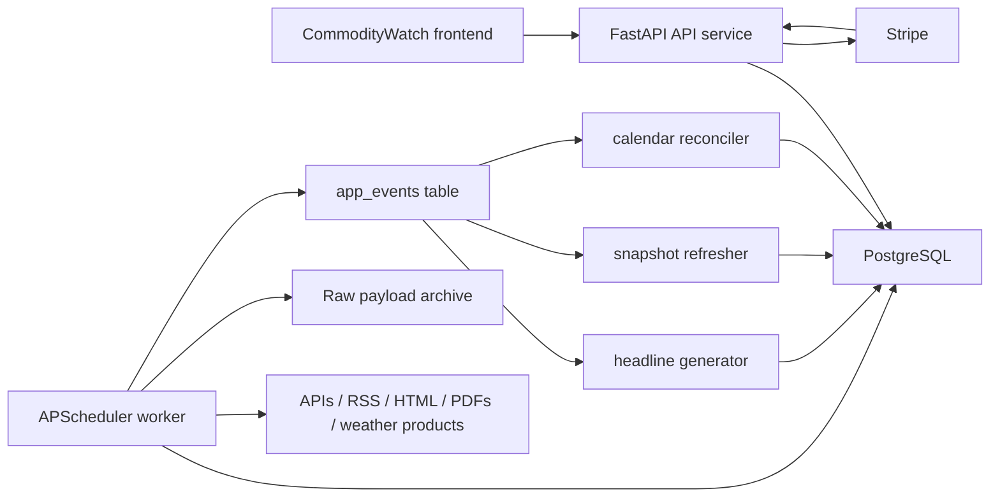

# CommodityWatch Backend Architecture

Note: the request says "six planned modules" but lists seven: `HeadlineWatch`, `PriceWatch`, `CalendarWatch`, `SupplyWatch`, `DemandWatch`, `InventoryWatch`, and `WeatherWatch`. This specification treats the platform as a seven-module system.

Note: the supplied planning docs are detailed for `HeadlineWatch`, `CalendarWatch`, `SupplyWatch`, `DemandWatch`, `InventoryWatch`, and `WeatherWatch`. `PriceWatch` is already shipped in the current repo but no new planning doc was supplied, so this design keeps the shared schema compatible with price series without re-specifying PriceWatch source coverage.

## 1. Architecture Recommendation

### Recommended stack

- Web framework: `FastAPI` with `Pydantic 2`, `SQLAlchemy 2.0`, and `Alembic`
- Database: `PostgreSQL 16`
- Managed database host: `Railway Postgres`
- Scheduler / jobs: one dedicated `worker` service running `APScheduler`
- Deployment: one `Railway` project with three services: `api`, `worker`, and `postgres`
- Caching: PostgreSQL snapshot cache tables plus small in-process TTL caches; no Redis initially
- Auth: email/password with `Argon2id` hashes and server-side session cookies
- Billing: `Stripe Checkout` + `Stripe Customer Portal` + webhook-driven subscription state sync

### Why this is the right fit

Use `FastAPI` because the platform is API-first, the frontend already behaves like a thin client, and the existing repo is closer to a lightweight Python HTTP service than to a Django monolith. FastAPI gives typed request/response contracts, automatic docs, clean dependency injection, and the option to mix sync and async code without forcing the entire app into async complexity.

Do not use Django here. Django's admin and auth are excellent, but the project's real complexity is the ingestion engine, not CMS-style CRUD. FastAPI keeps the API layer small and explicit while letting the worker own the heavy lifting.

Use plain PostgreSQL, not TimescaleDB, for the first several years. The workload described in the planning docs is in the thousands to low hundreds of thousands of rows, not millions per day. Well-indexed Postgres tables are enough. TimescaleDB would add extension coupling and migration overhead before it delivers real value.

Use `APScheduler` in one dedicated worker instead of `Celery + Redis` or platform cron as the primary scheduler:

- `Celery + Redis` is unnecessary operational weight for one developer.
- Pure platform cron is too fragmented for release windows, retries, holiday delays, and dynamic calendars.
- One APScheduler worker is enough, and the schedules stay in Python where the builder can understand and debug them.

Use Railway for both deployment and Postgres because the simplest maintainable setup is one platform, one Git push path, one env-var surface, and one internal network. A split deployment such as Vercel plus Neon plus a third worker host is workable, but it creates more integration edges than this project needs.

### Service topology



## 2. Core Design Principles

1. One shared database, not one database per module.
2. One shared taxonomy for commodities, geographies, units, sources, and releases.
3. One shared numeric observation model for SupplyWatch, DemandWatch, InventoryWatch, WeatherWatch, and eventually PriceWatch.
4. `HeadlineWatch` and `CalendarWatch` live in adjacent event/content tables linked back to the same taxonomies and source releases.
5. Revisions are append-only vintages. Never overwrite the only copy of a data point.
6. Derived indicators are first-class indicators, not frontend math.
7. Cross-module communication uses a database-backed outbox table, not Redis pub/sub.
8. Schedules are stored and reasoned about in the source's local timezone. UTC is produced for execution and API output, but local release time is the canonical truth.

## 3. Data Model

### 3.1 Important modeling decision

The planning docs talk about a canonical unit "per commodity". That is directionally correct, but not precise enough for a real shared schema because stocks, flows, capacity, and prices for the same commodity do not share one useful unit.

Example:

- Crude oil flow series: `kb/d`
- Crude oil stock series: `kb`
- Crude oil prices: `USD/bbl`

So the schema extends that rule to:

`canonical unit = commodity x measure_family`

That preserves the spirit of the planning docs while avoiding broken math in the balance view.

### 3.2 PostgreSQL DDL

```sql
CREATE EXTENSION IF NOT EXISTS pgcrypto;

CREATE TABLE app_modules (
    code text PRIMARY KEY CHECK (
        code IN (
            'headlinewatch',
            'pricewatch',
            'calendarwatch',
            'supplywatch',
            'demandwatch',
            'inventorywatch',
            'weatherwatch'
        )
    ),
    name text NOT NULL UNIQUE
);

INSERT INTO app_modules (code, name) VALUES
    ('headlinewatch', 'HeadlineWatch'),
    ('pricewatch', 'PriceWatch'),
    ('calendarwatch', 'CalendarWatch'),
    ('supplywatch', 'SupplyWatch'),
    ('demandwatch', 'DemandWatch'),
    ('inventorywatch', 'InventoryWatch'),
    ('weatherwatch', 'WeatherWatch')
ON CONFLICT (code) DO NOTHING;

CREATE TABLE commodities (
    code text PRIMARY KEY,
    name text NOT NULL,
    sector text NOT NULL CHECK (
        sector IN ('energy', 'metals', 'agriculture', 'macro', 'weather', 'cross_commodity')
    ),
    parent_code text REFERENCES commodities(code),
    is_active boolean NOT NULL DEFAULT true,
    metadata jsonb NOT NULL DEFAULT '{}'::jsonb
);

CREATE TABLE geographies (
    code text PRIMARY KEY,
    name text NOT NULL,
    geo_type text NOT NULL CHECK (
        geo_type IN (
            'country',
            'region',
            'market',
            'storage_region',
            'exchange_region',
            'basin',
            'grid_region',
            'global',
            'custom'
        )
    ),
    iso2 char(2),
    iso3 char(3),
    parent_code text REFERENCES geographies(code),
    is_active boolean NOT NULL DEFAULT true,
    metadata jsonb NOT NULL DEFAULT '{}'::jsonb
);

CREATE TABLE unit_definitions (
    code text PRIMARY KEY,
    name text NOT NULL,
    dimension text NOT NULL,
    symbol text,
    metadata jsonb NOT NULL DEFAULT '{}'::jsonb
);

CREATE TABLE commodity_unit_conventions (
    commodity_code text NOT NULL REFERENCES commodities(code),
    measure_family text NOT NULL CHECK (
        measure_family IN (
            'stock',
            'flow',
            'capacity',
            'utilisation',
            'price',
            'weather',
            'balance',
            'macro',
            'signal',
            'spread',
            'other'
        )
    ),
    canonical_unit_code text NOT NULL REFERENCES unit_definitions(code),
    notes text,
    PRIMARY KEY (commodity_code, measure_family)
);

CREATE TABLE sources (
    id uuid PRIMARY KEY DEFAULT gen_random_uuid(),
    slug text NOT NULL UNIQUE,
    name text NOT NULL,
    source_type text NOT NULL CHECK (
        source_type IN ('api', 'rss', 'html', 'pdf', 'csv', 'json', 'ftp', 'manual', 'webhook')
    ),
    legal_status text NOT NULL CHECK (
        legal_status IN (
            'public_domain',
            'cc_by',
            'press_release',
            'exchange_public',
            'public_registered',
            'needs_verification',
            'off_limits'
        )
    ),
    homepage_url text,
    docs_url text,
    default_timezone text,
    attribution_text text,
    rate_limit_notes text,
    active boolean NOT NULL DEFAULT true,
    created_at timestamptz NOT NULL DEFAULT now()
);

CREATE TABLE release_definitions (
    id uuid PRIMARY KEY DEFAULT gen_random_uuid(),
    source_id uuid NOT NULL REFERENCES sources(id),
    slug text NOT NULL UNIQUE,
    name text NOT NULL,
    release_kind text NOT NULL CHECK (
        release_kind IN (
            'data_release',
            'report',
            'calendar_event',
            'press_release',
            'weather_product',
            'earnings'
        )
    ),
    module_code text REFERENCES app_modules(code),
    commodity_code text REFERENCES commodities(code),
    geography_code text REFERENCES geographies(code),
    cadence text NOT NULL,
    schedule_timezone text NOT NULL,
    schedule_rule text NOT NULL,
    default_local_time time,
    is_calendar_driven boolean NOT NULL DEFAULT false,
    active boolean NOT NULL DEFAULT true,
    metadata jsonb NOT NULL DEFAULT '{}'::jsonb,
    created_at timestamptz NOT NULL DEFAULT now()
);

CREATE TABLE ingest_artifacts (
    id uuid PRIMARY KEY DEFAULT gen_random_uuid(),
    source_id uuid NOT NULL REFERENCES sources(id),
    storage_uri text NOT NULL,
    content_type text,
    sha256 text,
    http_status integer,
    size_bytes bigint,
    fetched_at timestamptz NOT NULL DEFAULT now(),
    metadata jsonb NOT NULL DEFAULT '{}'::jsonb
);

CREATE TABLE source_releases (
    id uuid PRIMARY KEY DEFAULT gen_random_uuid(),
    source_id uuid NOT NULL REFERENCES sources(id),
    release_definition_id uuid REFERENCES release_definitions(id),
    release_key text NOT NULL,
    release_name text NOT NULL,
    scheduled_at timestamptz,
    released_at timestamptz,
    period_start_at timestamptz,
    period_end_at timestamptz,
    release_timezone text,
    source_url text,
    status text NOT NULL CHECK (
        status IN ('scheduled', 'observed', 'late', 'failed', 'cancelled', 'superseded')
    ),
    primary_artifact_id uuid REFERENCES ingest_artifacts(id),
    notes text,
    metadata jsonb NOT NULL DEFAULT '{}'::jsonb,
    created_at timestamptz NOT NULL DEFAULT now(),
    UNIQUE (source_id, release_key)
);

CREATE TABLE ingest_runs (
    id uuid PRIMARY KEY DEFAULT gen_random_uuid(),
    job_name text NOT NULL,
    source_id uuid REFERENCES sources(id),
    release_definition_id uuid REFERENCES release_definitions(id),
    source_release_id uuid REFERENCES source_releases(id),
    run_mode text NOT NULL CHECK (run_mode IN ('live', 'retry', 'backfill', 'manual')),
    status text NOT NULL CHECK (status IN ('running', 'success', 'partial', 'failed')),
    started_at timestamptz NOT NULL DEFAULT now(),
    finished_at timestamptz,
    fetched_items integer NOT NULL DEFAULT 0,
    inserted_rows integer NOT NULL DEFAULT 0,
    updated_rows integer NOT NULL DEFAULT 0,
    quarantined_rows integer NOT NULL DEFAULT 0,
    error_text text,
    metadata jsonb NOT NULL DEFAULT '{}'::jsonb
);

CREATE TABLE indicators (
    id uuid PRIMARY KEY DEFAULT gen_random_uuid(),
    code text NOT NULL UNIQUE,
    name text NOT NULL,
    description text,
    measure_family text NOT NULL CHECK (
        measure_family IN (
            'stock',
            'flow',
            'capacity',
            'utilisation',
            'price',
            'weather',
            'balance',
            'macro',
            'signal',
            'spread',
            'other'
        )
    ),
    frequency text NOT NULL CHECK (
        frequency IN (
            'intraday',
            'hourly',
            'daily',
            'weekly',
            'monthly',
            'quarterly',
            'annual',
            'marketing_year',
            'irregular',
            'event'
        )
    ),
    commodity_code text REFERENCES commodities(code),
    geography_code text REFERENCES geographies(code),
    source_id uuid REFERENCES sources(id),
    source_series_key text,
    native_unit_code text REFERENCES unit_definitions(code),
    canonical_unit_code text REFERENCES unit_definitions(code),
    default_observation_kind text NOT NULL CHECK (
        default_observation_kind IN ('actual', 'estimate', 'forecast', 'proxy', 'derived', 'anomaly', 'signal')
    ),
    publication_lag interval,
    seasonal_profile text,
    is_seasonal boolean NOT NULL DEFAULT false,
    is_derived boolean NOT NULL DEFAULT false,
    formula text,
    visibility_tier text NOT NULL DEFAULT 'public' CHECK (
        visibility_tier IN ('public', 'free', 'premium', 'internal')
    ),
    active boolean NOT NULL DEFAULT true,
    metadata jsonb NOT NULL DEFAULT '{}'::jsonb,
    created_at timestamptz NOT NULL DEFAULT now()
);

CREATE TABLE indicator_modules (
    indicator_id uuid NOT NULL REFERENCES indicators(id) ON DELETE CASCADE,
    module_code text NOT NULL REFERENCES app_modules(code),
    is_primary boolean NOT NULL DEFAULT false,
    PRIMARY KEY (indicator_id, module_code)
);

CREATE UNIQUE INDEX uq_indicator_primary_module
    ON indicator_modules (indicator_id)
    WHERE is_primary;

CREATE TABLE indicator_dependencies (
    derived_indicator_id uuid NOT NULL REFERENCES indicators(id) ON DELETE CASCADE,
    source_indicator_id uuid NOT NULL REFERENCES indicators(id) ON DELETE CASCADE,
    dependency_role text NOT NULL,
    transform_notes text,
    PRIMARY KEY (derived_indicator_id, source_indicator_id),
    CHECK (derived_indicator_id <> source_indicator_id)
);

CREATE TABLE observations (
    id uuid PRIMARY KEY DEFAULT gen_random_uuid(),
    indicator_id uuid NOT NULL REFERENCES indicators(id) ON DELETE CASCADE,
    period_start_at timestamptz NOT NULL,
    period_end_at timestamptz NOT NULL,
    release_id uuid REFERENCES source_releases(id),
    release_date timestamptz,
    vintage_at timestamptz NOT NULL,
    observation_kind text NOT NULL CHECK (
        observation_kind IN ('actual', 'estimate', 'forecast', 'proxy', 'derived', 'anomaly', 'signal')
    ),
    value_native numeric(24,8) NOT NULL,
    unit_native_code text NOT NULL REFERENCES unit_definitions(code),
    value_canonical numeric(24,8) NOT NULL,
    unit_canonical_code text NOT NULL REFERENCES unit_definitions(code),
    currency_code text,
    is_latest boolean NOT NULL DEFAULT true,
    revision_sequence integer NOT NULL DEFAULT 1 CHECK (revision_sequence >= 1),
    supersedes_observation_id uuid REFERENCES observations(id),
    qa_status text NOT NULL DEFAULT 'passed' CHECK (
        qa_status IN ('passed', 'quarantined', 'manual_review', 'rejected')
    ),
    source_item_ref text,
    provenance_note text,
    metadata jsonb NOT NULL DEFAULT '{}'::jsonb,
    ingested_at timestamptz NOT NULL DEFAULT now(),
    created_at timestamptz NOT NULL DEFAULT now(),
    CHECK (period_start_at <= period_end_at)
);

CREATE UNIQUE INDEX uq_observations_vintage
    ON observations (indicator_id, period_start_at, period_end_at, observation_kind, vintage_at);

CREATE UNIQUE INDEX uq_observations_latest
    ON observations (indicator_id, period_start_at, period_end_at, observation_kind)
    WHERE is_latest;

CREATE TABLE seasonal_ranges (
    id uuid PRIMARY KEY DEFAULT gen_random_uuid(),
    indicator_id uuid NOT NULL REFERENCES indicators(id) ON DELETE CASCADE,
    profile_name text NOT NULL,
    period_type text NOT NULL CHECK (
        period_type IN ('week_of_year', 'month_of_year', 'day_of_year', 'marketing_year_month', 'gas_year_week')
    ),
    period_index integer NOT NULL,
    sample_size integer NOT NULL DEFAULT 0,
    range_start_year integer,
    range_end_year integer,
    p10 numeric(24,8),
    p25 numeric(24,8),
    p50 numeric(24,8),
    p75 numeric(24,8),
    p90 numeric(24,8),
    mean_value numeric(24,8),
    stddev_value numeric(24,8),
    computed_at timestamptz NOT NULL DEFAULT now(),
    metadata jsonb NOT NULL DEFAULT '{}'::jsonb,
    UNIQUE (indicator_id, profile_name, period_type, period_index)
);

CREATE TABLE module_snapshot_cache (
    module_code text NOT NULL REFERENCES app_modules(code),
    snapshot_key text NOT NULL,
    as_of timestamptz NOT NULL,
    payload jsonb NOT NULL,
    expires_at timestamptz NOT NULL,
    generated_at timestamptz NOT NULL DEFAULT now(),
    PRIMARY KEY (module_code, snapshot_key)
);

CREATE TABLE app_events (
    id uuid PRIMARY KEY DEFAULT gen_random_uuid(),
    idempotency_key text NOT NULL UNIQUE,
    event_type text NOT NULL,
    producer_module_code text NOT NULL REFERENCES app_modules(code),
    aggregate_type text NOT NULL,
    aggregate_id uuid,
    commodity_code text REFERENCES commodities(code),
    geography_code text REFERENCES geographies(code),
    indicator_id uuid REFERENCES indicators(id),
    observation_id uuid REFERENCES observations(id),
    source_release_id uuid REFERENCES source_releases(id),
    status text NOT NULL DEFAULT 'pending' CHECK (
        status IN ('pending', 'processing', 'processed', 'failed', 'discarded')
    ),
    payload jsonb NOT NULL DEFAULT '{}'::jsonb,
    available_at timestamptz NOT NULL DEFAULT now(),
    created_at timestamptz NOT NULL DEFAULT now(),
    processed_at timestamptz,
    error_text text
);

CREATE TABLE headlines (
    id uuid PRIMARY KEY DEFAULT gen_random_uuid(),
    dedupe_key text NOT NULL UNIQUE,
    source_id uuid REFERENCES sources(id),
    source_release_id uuid REFERENCES source_releases(id),
    trigger_event_id uuid REFERENCES app_events(id),
    title text NOT NULL,
    summary text,
    body text,
    url text NOT NULL,
    source_label text NOT NULL,
    published_at timestamptz NOT NULL,
    headline_type text NOT NULL CHECK (
        headline_type IN ('external', 'auto_trigger', 'editorial', 'system')
    ),
    sentiment text CHECK (sentiment IN ('bullish', 'bearish', 'neutral') OR sentiment IS NULL),
    module_origin text REFERENCES app_modules(code),
    commodity_code text REFERENCES commodities(code),
    geography_code text REFERENCES geographies(code),
    visibility_tier text NOT NULL DEFAULT 'public' CHECK (
        visibility_tier IN ('public', 'free', 'premium', 'internal')
    ),
    metadata jsonb NOT NULL DEFAULT '{}'::jsonb,
    created_at timestamptz NOT NULL DEFAULT now()
);

CREATE TABLE headline_indicator_links (
    headline_id uuid NOT NULL REFERENCES headlines(id) ON DELETE CASCADE,
    indicator_id uuid NOT NULL REFERENCES indicators(id) ON DELETE CASCADE,
    observation_id uuid REFERENCES observations(id),
    relation_type text NOT NULL,
    PRIMARY KEY (headline_id, indicator_id, relation_type)
);

CREATE TABLE calendar_events (
    id uuid PRIMARY KEY DEFAULT gen_random_uuid(),
    dedupe_key text NOT NULL UNIQUE,
    release_definition_id uuid REFERENCES release_definitions(id),
    source_release_id uuid REFERENCES source_releases(id),
    title text NOT NULL,
    event_type text NOT NULL CHECK (
        event_type IN ('data_release', 'report', 'earnings', 'weather_window', 'holiday', 'manual')
    ),
    module_code text REFERENCES app_modules(code),
    commodity_code text REFERENCES commodities(code),
    geography_code text REFERENCES geographies(code),
    starts_at timestamptz NOT NULL,
    ends_at timestamptz,
    scheduled_timezone text,
    status text NOT NULL CHECK (
        status IN ('scheduled', 'confirmed', 'occurred', 'cancelled', 'delayed', 'pending_review')
    ),
    source_url text,
    source_label text,
    redistribution_ok boolean NOT NULL DEFAULT false,
    notes text,
    metadata jsonb NOT NULL DEFAULT '{}'::jsonb,
    created_at timestamptz NOT NULL DEFAULT now(),
    updated_at timestamptz NOT NULL DEFAULT now()
);

CREATE TABLE calendar_event_changes (
    id bigserial PRIMARY KEY,
    calendar_event_id uuid NOT NULL REFERENCES calendar_events(id) ON DELETE CASCADE,
    field_name text NOT NULL,
    old_value text,
    new_value text,
    detected_at timestamptz NOT NULL DEFAULT now(),
    requires_review boolean NOT NULL DEFAULT false
);

CREATE TABLE calendar_review_items (
    id bigserial PRIMARY KEY,
    calendar_event_id uuid NOT NULL REFERENCES calendar_events(id) ON DELETE CASCADE,
    reason text NOT NULL,
    status text NOT NULL DEFAULT 'pending' CHECK (
        status IN ('pending', 'approved', 'rejected')
    ),
    resolution_notes text,
    created_at timestamptz NOT NULL DEFAULT now(),
    resolved_at timestamptz
);

CREATE TABLE users (
    id uuid PRIMARY KEY DEFAULT gen_random_uuid(),
    email text NOT NULL,
    password_hash text NOT NULL,
    full_name text,
    plan_code text NOT NULL DEFAULT 'free' CHECK (
        plan_code IN ('free', 'pro', 'admin')
    ),
    account_status text NOT NULL DEFAULT 'active' CHECK (
        account_status IN ('active', 'past_due', 'cancelled', 'disabled')
    ),
    timezone text NOT NULL DEFAULT 'UTC',
    email_verified_at timestamptz,
    created_at timestamptz NOT NULL DEFAULT now(),
    updated_at timestamptz NOT NULL DEFAULT now(),
    last_login_at timestamptz
);

CREATE UNIQUE INDEX uq_users_email_lower ON users ((lower(email)));

CREATE TABLE user_sessions (
    id uuid PRIMARY KEY DEFAULT gen_random_uuid(),
    user_id uuid NOT NULL REFERENCES users(id) ON DELETE CASCADE,
    session_token_hash text NOT NULL UNIQUE,
    csrf_token_hash text NOT NULL UNIQUE,
    ip_address inet,
    user_agent text,
    created_at timestamptz NOT NULL DEFAULT now(),
    last_seen_at timestamptz NOT NULL DEFAULT now(),
    expires_at timestamptz NOT NULL,
    revoked_at timestamptz
);

CREATE TABLE subscriptions (
    id uuid PRIMARY KEY DEFAULT gen_random_uuid(),
    user_id uuid NOT NULL REFERENCES users(id) ON DELETE CASCADE,
    provider text NOT NULL CHECK (provider IN ('stripe')),
    plan_code text NOT NULL CHECK (plan_code IN ('free', 'pro')),
    stripe_customer_id text UNIQUE,
    stripe_subscription_id text UNIQUE,
    checkout_session_id text,
    status text NOT NULL CHECK (
        status IN ('trialing', 'active', 'past_due', 'cancelled', 'incomplete', 'unpaid')
    ),
    current_period_start timestamptz,
    current_period_end timestamptz,
    cancel_at_period_end boolean NOT NULL DEFAULT false,
    metadata jsonb NOT NULL DEFAULT '{}'::jsonb,
    created_at timestamptz NOT NULL DEFAULT now(),
    updated_at timestamptz NOT NULL DEFAULT now()
);

CREATE TABLE billing_webhook_events (
    id bigserial PRIMARY KEY,
    provider text NOT NULL CHECK (provider IN ('stripe')),
    provider_event_id text NOT NULL UNIQUE,
    event_type text NOT NULL,
    payload jsonb NOT NULL,
    status text NOT NULL CHECK (status IN ('received', 'processed', 'failed')),
    received_at timestamptz NOT NULL DEFAULT now(),
    processed_at timestamptz,
    error_text text
);

CREATE INDEX idx_indicators_filter
    ON indicators (commodity_code, geography_code, frequency, active);

CREATE INDEX idx_indicator_modules_module
    ON indicator_modules (module_code, indicator_id);

CREATE INDEX idx_observations_indicator_period_latest
    ON observations (indicator_id, period_end_at DESC)
    WHERE is_latest;

CREATE INDEX idx_observations_indicator_vintage
    ON observations (indicator_id, period_end_at DESC, vintage_at DESC);

CREATE INDEX idx_observations_release
    ON observations (release_id);

CREATE INDEX idx_source_releases_schedule
    ON source_releases (scheduled_at DESC);

CREATE INDEX idx_source_releases_observed
    ON source_releases (released_at DESC);

CREATE INDEX idx_seasonal_ranges_lookup
    ON seasonal_ranges (indicator_id, profile_name, period_type, period_index);

CREATE INDEX idx_headlines_published
    ON headlines (published_at DESC);

CREATE INDEX idx_headlines_commodity_published
    ON headlines (commodity_code, published_at DESC);

CREATE INDEX idx_calendar_events_start
    ON calendar_events (starts_at ASC);

CREATE INDEX idx_calendar_events_module_start
    ON calendar_events (module_code, starts_at ASC);

CREATE INDEX idx_app_events_pending
    ON app_events (status, available_at ASC)
    WHERE status IN ('pending', 'failed');

CREATE INDEX idx_ingest_runs_recent
    ON ingest_runs (started_at DESC);
```

### 3.3 Entity relationships

- `sources` define who published something.
- `release_definitions` define recurring or expected release patterns.
- `source_releases` are actual observed releases or release occurrences.
- `indicators` define a time series.
- `indicator_modules` attach one indicator to one or more modules.
- `observations` store every vintage for an indicator and link back to `source_releases`.
- `seasonal_ranges` precompute context for seasonal series.
- `app_events` are the durable outbox for cross-module reactions.
- `headlines` and `calendar_events` are event/content tables linked back to the same commodities, geographies, releases, and outbox events.
- `users`, `user_sessions`, and `subscriptions` support the freemium model.

### 3.4 Notes on the schema

#### Why append-only vintages

If EIA revises last week's crude stock number, the new observation is inserted as a new vintage and marked `is_latest = true`; the prior row stays in the table. This is simpler and safer than a separate revision table because the API can answer all of these questions from one relation:

- What is the current latest value?
- What was first reported?
- What changed between vintages?
- What did users know on a given date?

#### Why `HeadlineWatch` and `CalendarWatch` are adjacent, not forced into `observations`

Those modules are event/content products, not numeric time series. Forcing headlines into a numeric observation table would be a design smell. They still share the same taxonomies and provenance keys, so they remain integrated without corrupting the observation model.

#### How derived indicators work

Derived indicators are normal rows in `indicators` with:

- `is_derived = true`
- `formula` populated
- dependencies stored in `indicator_dependencies`

Examples:

- `days_of_supply = stocks / trailing demand rate`
- `opec_compliance = actual output / quota`
- `gas_storage_vs_5y = actual storage - seasonal median`

The worker computes and stores these just like sourced indicators. The frontend never recomputes them as business logic.

### 3.5 Seed data

Keep the schema generic and seed the reference tables from versioned files:

- `seed/commodities.yml`
- `seed/geographies.yml`
- `seed/units.yml`
- `seed/sources.yml`
- `seed/indicators/*.yml`

That matters because the indicator catalog will grow over time and the builder should not hand-edit SQL inserts.

### 3.6 Index strategy for primary query patterns

Primary query patterns and the indexes that matter:

1. Indicator detail page:
   `observations WHERE indicator_id = ? AND is_latest = true AND period_end_at BETWEEN ? AND ?`
   Use `idx_observations_indicator_period_latest`.

2. Latest card / snapshot:
   `observations WHERE indicator_id IN (...) AND is_latest = true ORDER BY period_end_at DESC`
   Use `idx_observations_indicator_period_latest`.

3. Cross-module balance view:
   Find indicators by `commodity_code + geography_code + module + measure_family`, then join latest observations by date range.
   Use `idx_indicators_filter` + `idx_indicator_modules_module` + `idx_observations_indicator_period_latest`.

4. Headlines feed:
   `headlines WHERE commodity_code = ? ORDER BY published_at DESC`
   Use `idx_headlines_commodity_published`.

5. Calendar range query:
   `calendar_events WHERE starts_at BETWEEN ? AND ?`
   Use `idx_calendar_events_start`.

### 3.7 Partitioning and archiving

Do not partition at launch.

Partition only when either of these becomes true:

- `observations` exceeds roughly 10 million rows
- a single query path becomes dominated by time pruning and vacuum cost

If that day comes, range partition `observations` by `period_end_at` year. Until then, plain tables keep migrations and debugging simpler.

## 4. API Design

### 4.1 General API conventions

- Base path: `/api`
- JSON only
- ISO 8601 timestamps in UTC
- Dates use `YYYY-MM-DD`
- Errors use one envelope:

```json
{
  "error": {
    "code": "not_found",
    "message": "Indicator not found"
  }
}
```

- Public cacheable endpoints return `ETag` and `Last-Modified`
- Cursor pagination is used for append-only feeds (`headlines`, `calendar`)
- Indicator catalog is small enough that cursor pagination is optional; support it anyway for consistency

### 4.2 Authentication model for the API

- Anonymous:
  - `GET /api/headlines`
  - `GET /api/calendar`
  - `GET /api/indicators`
  - `GET /api/indicators/{id}/latest` for public/free indicators
  - `GET /api/snapshot/{module}` for public modules and limited cards

- Registered free user:
  - Everything above
  - Limited history, for example last 90 days or 1 year depending on module
  - Lower rate limits than paid

- Paid user:
  - Full indicator catalog
  - Full history
  - Balance endpoint
  - Premium snapshots
  - Export endpoints later

### 4.3 Endpoint contracts

#### `GET /api/indicators`

Purpose: list indicator metadata for navigation, filters, and catalog views.

Query params:

- `module: str | None`
- `commodity: str | None`
- `geography: str | None`
- `frequency: str | None`
- `measure_family: str | None`
- `visibility: str = "public"`
- `active: bool = true`
- `limit: int = 200`
- `cursor: str | None`

Response:

```json
{
  "items": [
    {
      "id": "uuid",
      "code": "EIA_CRUDE_US_COMMERCIAL_STOCKS",
      "name": "US Commercial Crude Stocks ex SPR",
      "modules": ["inventorywatch"],
      "commodity_code": "crude_oil",
      "geography_code": "US",
      "measure_family": "stock",
      "frequency": "weekly",
      "native_unit": "kb",
      "canonical_unit": "kb",
      "is_seasonal": true,
      "is_derived": false,
      "visibility_tier": "public",
      "latest_release_at": "2026-03-25T14:35:00Z"
    }
  ],
  "next_cursor": null
}
```

Pagination:

- Cursor-based
- Cursor can be encoded from `(code, id)`

Cache:

- Anonymous/public response: `Cache-Control: public, max-age=3600, stale-while-revalidate=86400`
- Authenticated: `private, max-age=300`

Auth:

- Public/free metadata is anonymous
- Premium indicators appear only for authenticated paid users

#### `GET /api/indicators/{indicator_id}/data`

Purpose: return a time series plus seasonal context and metadata.

Query params:

- `start_date: date | None` default = today minus 365 days
- `end_date: date | None` default = today
- `downsample: str = "auto"` where allowed values are `auto`, `raw`, `daily`, `weekly`, `monthly`, `quarterly`
- `vintage: str = "latest"` where allowed values are `latest`, `first`, `as_of`
- `as_of: datetime | None`
- `include_seasonal: bool = true`
- `seasonal_profile: str | None`
- `limit_points: int = 2000`

Response:

```json
{
  "indicator": {
    "id": "uuid",
    "code": "EIA_NG_STORAGE_US",
    "name": "US Natural Gas in Storage",
    "modules": ["inventorywatch"],
    "commodity_code": "natural_gas",
    "geography_code": "US",
    "frequency": "weekly",
    "measure_family": "stock",
    "unit": "bcf"
  },
  "series": [
    {
      "period_start_at": "2026-03-13T00:00:00Z",
      "period_end_at": "2026-03-20T00:00:00Z",
      "release_date": "2026-03-26T14:35:00Z",
      "vintage_at": "2026-03-26T14:35:12Z",
      "value": 1744.0,
      "unit": "bcf",
      "observation_kind": "actual",
      "revision_sequence": 1
    }
  ],
  "seasonal_range": [
    {
      "period_index": 12,
      "p25": 1680.0,
      "p50": 1722.0,
      "p75": 1788.0,
      "p90": 1840.0,
      "mean": 1735.0,
      "stddev": 84.0
    }
  ],
  "metadata": {
    "latest_release_id": "uuid",
    "latest_release_at": "2026-03-26T14:35:00Z",
    "source_url": "https://www.eia.gov/..."
  }
}
```

Pagination:

- None
- Require bounded date range and cap `limit_points`

Cache:

- Public/free: `public, max-age=300, stale-while-revalidate=1800`
- Paid/private: `private, max-age=60`

Auth:

- Anonymous or free users get truncated history
- Paid users get full history and all vintages

#### `GET /api/indicators/{indicator_id}/latest`

Purpose: return the latest point with change and seasonal deviation already computed.

Query params:

- None

Response:

```json
{
  "indicator": {
    "id": "uuid",
    "code": "EIA_CRUDE_US_COMMERCIAL_STOCKS"
  },
  "latest": {
    "period_end_at": "2026-03-20T00:00:00Z",
    "release_date": "2026-03-25T14:35:00Z",
    "value": 438940.0,
    "unit": "kb",
    "change_from_prior_abs": -3340.0,
    "change_from_prior_pct": -0.75,
    "deviation_from_seasonal_abs": -15200.0,
    "deviation_from_seasonal_zscore": -1.31,
    "revision_sequence": 1
  }
}
```

Pagination:

- None

Cache:

- `public, max-age=300, stale-while-revalidate=900`

Auth:

- Same entitlement rule as indicator metadata

#### `GET /api/snapshot/{module}`

Purpose: return precomputed "market snapshot" cards for a module.

Path params:

- `module`: `inventorywatch`, `supplywatch`, `demandwatch`, `weatherwatch`

Query params:

- `commodity: str | None`
- `geography: str | None`
- `limit: int = 20`
- `include_sparklines: bool = true`

Response:

```json
{
  "module": "inventorywatch",
  "generated_at": "2026-03-27T05:00:02Z",
  "expires_at": "2026-03-27T05:05:02Z",
  "cards": [
    {
      "indicator_id": "uuid",
      "code": "EIA_CRUDE_US_COMMERCIAL_STOCKS",
      "name": "US Crude Stocks ex SPR",
      "commodity_code": "crude_oil",
      "geography_code": "US",
      "latest_value": 438940.0,
      "unit": "kb",
      "change_abs": -3340.0,
      "deviation_abs": -15200.0,
      "signal": "tightening",
      "sparkline": [441100.0, 440500.0, 439200.0, 438940.0],
      "last_updated_at": "2026-03-25T14:35:12Z"
    }
  ]
}
```

Pagination:

- None

Cache:

- `public, max-age=300, stale-while-revalidate=900`

Auth:

- Anonymous gets public cards only
- Paid gets full module card set

#### `GET /api/headlines`

Purpose: HeadlineWatch feed.

Query params:

- `commodity: str | None`
- `source: str | None`
- `module_origin: str | None`
- `from: datetime | None`
- `to: datetime | None`
- `auto_only: bool = false`
- `limit: int = 50`
- `cursor: str | None`

Response:

```json
{
  "items": [
    {
      "id": "uuid",
      "title": "US crude stocks fall more than seasonal norms",
      "summary": "EIA weekly data showed...",
      "url": "https://commoditywatch.co/...",
      "source_label": "CommodityWatch",
      "headline_type": "auto_trigger",
      "module_origin": "inventorywatch",
      "commodity_code": "crude_oil",
      "geography_code": "US",
      "published_at": "2026-03-25T14:37:08Z"
    }
  ],
  "next_cursor": null
}
```

Pagination:

- Cursor-based on `(published_at desc, id desc)`

Cache:

- `public, max-age=60, stale-while-revalidate=300`

Auth:

- Public

#### `GET /api/calendar`

Purpose: CalendarWatch feed of upcoming and recent events.

Query params:

- `from: datetime`
- `to: datetime`
- `commodity: str | None`
- `module: str | None`
- `event_type: str | None`
- `confirmed_only: bool = true`
- `limit: int = 100`
- `cursor: str | None`

Response:

```json
{
  "items": [
    {
      "id": "uuid",
      "title": "EIA Weekly Petroleum Status Report",
      "event_type": "data_release",
      "module_code": "inventorywatch",
      "commodity_code": "crude_oil",
      "starts_at": "2026-04-01T14:30:00Z",
      "status": "scheduled",
      "source_label": "EIA",
      "source_url": "https://www.eia.gov/..."
    }
  ],
  "next_cursor": null
}
```

Pagination:

- Cursor-based on `(starts_at asc, id asc)`

Cache:

- `public, max-age=900, stale-while-revalidate=3600`

Auth:

- Public

#### `GET /api/weather/current`

Purpose: current and near-term WeatherWatch summary.

Query params:

- `geography: str | None` repeatable; default = `US_ENERGY`, `US_CORN_BELT`, `EU_ENERGY`
- `include_forecast: bool = true`

Response:

```json
{
  "generated_at": "2026-03-27T05:00:00Z",
  "regions": [
    {
      "geography_code": "US_ENERGY",
      "current": {
        "temp_anomaly_c": -2.1,
        "hdd_actual_week": 198.0,
        "hdd_vs_10y": 21.0
      },
      "forecast": {
        "outlook_6_10": "colder_than_normal",
        "outlook_8_14": "colder_than_normal",
        "forecast_shift_hdd": 15.0
      },
      "alerts": []
    }
  ]
}
```

Pagination:

- None

Cache:

- `public, max-age=1800, stale-while-revalidate=3600`

Auth:

- Anonymous gets a small default region set
- Paid gets all regions and deeper forecast detail

#### `GET /api/commodities/{commodity}/balance`

Purpose: align supply, demand, inventory, and weather context on one axis.

Path params:

- `commodity: str`

Query params:

- `geography: str = "US"`
- `start_date: date | None`
- `end_date: date | None`
- `frequency: str = "auto"`
- `inventory_mode: str = "level"` where values are `level` or `change`
- `include_weather: bool = true`

Response:

```json
{
  "commodity_code": "crude_oil",
  "geography_code": "US",
  "frequency": "weekly",
  "series": {
    "supply": [
      {"date": "2026-03-20", "value": 13425.0, "unit": "kb/d"}
    ],
    "demand": [
      {"date": "2026-03-20", "value": 20410.0, "unit": "kb/d"}
    ],
    "inventory": [
      {"date": "2026-03-20", "value": 438940.0, "unit": "kb"}
    ],
    "inventory_change": [
      {"date": "2026-03-20", "value": -3340.0, "unit": "kb"}
    ],
    "net_balance": [
      {"date": "2026-03-20", "value": -6985.0, "unit": "kb/d"}
    ]
  },
  "notes": [
    "Supply and demand are aligned in canonical flow units.",
    "Inventory is shown as both level and change because stocks are not a flow series."
  ]
}
```

Pagination:

- None

Cache:

- `private, max-age=300`

Auth:

- Paid only

### 4.4 Auth and billing endpoints

Use these additional routes:

- `POST /api/auth/register`
- `POST /api/auth/login`
- `POST /api/auth/logout`
- `GET /api/auth/me`
- `POST /api/billing/create-checkout-session`
- `POST /api/billing/create-portal-session`
- `POST /api/webhooks/stripe`

These are intentionally simple. The backend should support one paid plan first, not a complex entitlement graph.

## 5. Ingestion Pipeline Architecture

### 5.1 Execution model

One `worker` process owns all scheduled and manual jobs.

Each ingestion job follows the same pipeline:

1. Determine due release or poll target
2. Fetch raw payload
3. Archive raw payload to `ingest_artifacts`
4. Parse into normalized records
5. Validate shape, units, ranges, and source fingerprint
6. Upsert `source_releases`
7. Upsert `indicators` if a new series was discovered
8. Insert new `observations` vintages
9. Mark prior vintages `is_latest = false`
10. Compute derived indicators
11. Refresh affected module snapshots
12. Emit `app_events`
13. Consumers generate headlines and reconcile calendar entries

### 5.2 Source category patterns

#### API sources

Applies to:

- EIA
- GIE / AGSI+
- USDA NASS
- USDA PSD
- FRED
- Baker Hughes if structured source is available

Pattern:

- Trigger: APScheduler cron or calendar-driven trigger
- Client: `httpx` with retry policy and explicit timeout
- Validation: Pydantic models for payload shape plus per-series sanity checks
- Revision handling:
  - locate existing latest row for `indicator + period`
  - if new value differs, insert new vintage and increment `revision_sequence`
- Error handling:
  - exponential backoff for transient HTTP errors
  - retry window for late releases
  - on final failure, write failed `ingest_runs` row and emit `source.late_release` or `source.fetch_failed`
- Write path:
  - never overwrite the only copy
  - always insert a new row when the released value changed

#### Web scraping sources

Applies to:

- LME
- COMEX / CME warehouse reports
- ICE certified stocks
- ETF holdings pages
- CPC HTML tables or image pages when needed

Framework recommendation:

- Default: `requests` / `httpx` + `BeautifulSoup`
- Use `Playwright` only for pages that cannot be parsed from static HTML
- Do not use `Scrapy`; it is more framework than this project needs

Structural change detection:

- Store expected table headers or CSS selectors in code
- Compute a simple parse fingerprint
- If required headers vanish, fail the job and emit a review event

Validation:

- row counts within expected range
- units match series definition
- values within per-indicator bounds
- release date on page is not stale

Politeness:

- one request per page/report
- random small jitter
- descriptive `User-Agent`
- no parallel brute-force scraping

#### PDF and report sources

Applies to:

- USDA reports when API tables are incomplete
- some weather products

Recommendation:

- First choice: machine-readable alternative if available
- Second choice: `pdfplumber` for text/tables
- Third choice: manual extractor for a specific stable report template

Validation:

- verify the report title and date
- verify expected table names exist
- verify row and column counts
- compare extracted totals with published summary values when available

### 5.3 Master schedule

Important: store schedules in source-local timezones. The UTC values below are the execution targets. For releases tied to U.S. or European local times, the UTC value changes with daylight saving time. The worker should compute UTC from the local timezone, not hard-code UTC year-round.

| Source / job | Modules affected | Trigger type | Local schedule | UTC execution target | Dependency notes |
|---|---|---|---|---|---|
| Headline RSS poller | HeadlineWatch | recurring | every 15 min | every `:00/:15/:30/:45` UTC | parse -> dedupe -> classify -> publish |
| Corporate press-release poller | HeadlineWatch, SupplyWatch | recurring | every 30 min weekdays | every `:00/:30` UTC | parse -> dedupe -> optional headline publish |
| Calendar source refresh | CalendarWatch | recurring | daily | 03:00 UTC | refresh future schedules before data jobs |
| EIA WPSR | Inventory, Supply, Demand, Headline, Calendar | fixed | Wed 10:35 ET | 14:35 UTC in EDT, 15:35 UTC in EST | fetch WPSR once, fan out to all three modules |
| EIA WNGS | Inventory, Headline, Calendar | fixed | Thu 10:35 ET | 14:35 UTC in EDT, 15:35 UTC in EST | gas storage ingest must finish before weather-context enrich |
| EIA Grid Monitor | Supply, Demand | recurring | every 15 min | every 15 min UTC | raw hourly store -> daily aggregates |
| EIA STEO | Supply, Demand, Headline, Calendar | fixed | first Tue after first Thu, 12:20 ET | 16:20 UTC in EDT, 17:20 UTC in EST | fetch release -> update forecast/estimate series |
| GIE / AGSI+ | Inventory | fixed | daily 18:00 Europe/Brussels | 16:00 UTC in CEST, 17:00 UTC in CET | EU aggregate first, countries second |
| Baker Hughes rig count | Supply, Headline, Calendar | fixed | Fri 13:05 ET | 17:05 UTC in EDT, 18:05 UTC in EST | after ingest, compute 4-week rig delta |
| USDA WASDE PDF | Supply, Demand, Inventory, Headline, Calendar | calendar-driven | scheduled release + 5 min | `scheduled_at + 5m` UTC | fetch PDF first so wording is archived |
| USDA PSD structured data | Supply, Demand, Inventory | calendar-driven | scheduled release + 10 min | `scheduled_at + 10m` UTC | run after WASDE PDF fetch |
| USDA Grain Stocks | Inventory, Calendar, Headline | calendar-driven | scheduled release + 5 min | `scheduled_at + 5m` UTC | same release chain as NASS |
| USDA Crop Progress | Supply, Calendar | fixed | Mon 16:05 ET | 20:05 UTC in EDT, 21:05 UTC in EST | seasonal job; disable outside active season if desired |
| USDA Export Sales | Demand, Calendar | calendar-driven | scheduled release + 5 min | `scheduled_at + 5m` UTC | update ag demand cards and movers |
| FRED due-release scanner | Demand, Calendar | recurring | weekdays 08:00-18:00 ET release window | every 15 min from 12:00-22:00 UTC in EDT | scan due calendar events, then fetch only due series |
| Eurostat / ECB / BLS / ONS / FOMC calendars | CalendarWatch | recurring | daily | 03:15 UTC | refresh release calendar state |
| LME warehouse scrape | Inventory | fixed | daily 18:00 Europe/London | 17:00 UTC in BST, 18:00 UTC in GMT | scrape once, parse all metals tables |
| COMEX warehouse scrape | Inventory | fixed | daily 17:00 ET | 21:00 UTC in EDT, 22:00 UTC in EST | gold, silver, copper in one run |
| ICE certified stocks scrape | Inventory | fixed | daily 17:00 ET | 21:00 UTC in EDT, 22:00 UTC in EST | coffee, cocoa, sugar, cotton |
| ETF holdings scrape | Inventory | fixed | daily 20:00 ET | 00:00 UTC next day in EDT, 01:00 UTC in EST | GLD, IAU, SLV in one run |
| SHFE warehouse scrape | Inventory | fixed | Fri 18:00 Asia/Shanghai | 10:00 UTC | weekly China metals job |
| UNICA / MPOB / CONAB watch | Supply, Headline, Calendar | poll window | expected release windows only | 10:00 UTC and 18:00 UTC | attachment-first, not aggressive scraping |
| CPC 6-10 / 8-14 outlook archiver | Weather, Headline | poll window | daily | every 30 min from 12:00-22:00 UTC until new issue appears | archive images, then compute forecast-shift summary |
| HDD / CDD daily ingest | Weather, Demand, Inventory | fixed | daily 08:00 ET | 12:00 UTC in EDT, 13:00 UTC in EST | daily actuals feed Weather first, then Demand/Inventory consumers |
| HDD / CDD weekly ingest | Weather, Demand, Inventory | fixed | Mon 10:00 ET | 14:00 UTC in EDT, 15:00 UTC in EST | weekly aggregates and anomalies |
| U.S. Drought Monitor | Weather, Headline, Calendar | fixed | Thu 08:35 ET | 12:35 UTC in EDT, 13:35 UTC in EST | archive map, update drought metrics |
| NHC advisories | Weather, Headline | recurring seasonal | every 3h Jun-Nov | 00:00 / 03:00 / 06:00 / 09:00 / 12:00 / 15:00 / 18:00 / 21:00 UTC | only active in hurricane season or when storm exists |
| ENSO diagnostic and probability update | Weather, Headline, Calendar | poll window | monthly around 8th-12th | 16:00 UTC, repeat every 2h until seen | monthly low-frequency weather macro job |
| ERA5 monthly backfill / refresh | Weather | recurring | monthly | 04:00 UTC on day 6 | low-priority regional climatology refresh |
| Snapshot refresher | All snapshot modules | event-driven + nightly sweep | on source event + nightly | event-driven, plus 02:00 UTC sweep | rebuild only touched module keys |
| Staleness checker | All | recurring | hourly | top of hour UTC | emits late-release events and stale badges |

### 5.4 Dependency ordering

Use the following ordering for multi-step sources:

#### EIA WPSR chain

1. Fetch raw WPSR payload
2. Write raw payload artifact
3. Update Inventory indicators and observations
4. Update Supply indicators and observations
5. Update Demand indicators and observations
6. Recompute derived indicators:
   - crude days of supply
   - refinery yields
   - 4-week demand averages
7. Refresh affected snapshots
8. Emit anomaly events
9. Generate HeadlineWatch auto-items if thresholds fire
10. Mark corresponding calendar event as occurred

#### USDA WASDE / PSD chain

1. Fetch PDF
2. Archive PDF
3. Fetch structured PSD tables
4. Parse both
5. Validate report date alignment
6. Update Supply, Demand, and Inventory series
7. Recompute derived balance metrics
8. Emit revision / surprise events
9. Create headlines if thresholds fire
10. Mark calendar occurrence as completed

#### Weather HDD / CDD chain

1. Fetch weather data
2. Write WeatherWatch observations
3. Recompute WeatherWatch summaries
4. Trigger DemandWatch context refresh
5. Trigger InventoryWatch gas-storage context refresh
6. Emit headline trigger only if anomaly thresholds are crossed

### 5.5 Backfill strategy

Backfill is a separate CLI mode, not a hidden feature of the live scheduler.

Commands:

- `python -m app.ingest.backfill --source eia_wpsr --from 2010-01-01`
- `python -m app.ingest.backfill --source agsi --from 2015-01-01`
- `python -m app.ingest.backfill --source wasde --from 2014-01-01`

Rules:

- chunk by year or release window
- write `ingest_runs` rows
- set `run_mode = 'backfill'`
- suppress public side effects by default
- after each source backfill, run:
  - seasonal recomputation
  - snapshot refresh
  - optional integrity diff

### 5.6 Source outage behavior

If a source is late or down:

- do not fill forward
- leave the last valid value in place
- mark series stale in snapshot output
- emit `source.late_release`
- keep retrying inside the release window
- escalate only after final retry budget is exhausted

When the source returns, ingest normally. If the missed release bundled revisions, the append-only vintage model handles it.

### 5.7 Notifications

Use one webhook destination, not a full alerting platform at launch.

Recommendation:

- `CW_ALERT_WEBHOOK_URL` for Slack or Discord
- immediate alert on:
  - parse failure
  - repeated HTTP failure
  - missing scheduled release after retry window
  - anomaly in row count or bounds
- daily digest from `ingest_runs` and failed `app_events`

## 6. Cross-Module Event System

### Recommended pattern

Use a database-backed outbox table: `app_events`.

Do not use Redis pub/sub.

Do not build a bespoke in-process signal system as the primary integration mechanism.

Why the outbox table is the right tradeoff:

- durable
- easy to inspect with SQL
- easy to replay
- no extra infrastructure
- works across API process and worker process

### Event flow

1. A producer job inserts or updates observations.
2. In the same transaction or immediately after, it inserts one or more `app_events` rows with stable `idempotency_key`s.
3. A small consumer loop polls `app_events WHERE status = 'pending'`.
4. Each consumer marks `processing`, handles the event, then marks `processed` or `failed`.

### HeadlineWatch auto-trigger

Pattern:

`processing layer -> app_events -> headline generator -> headlines table`

Examples:

- inventory draw vs seasonal range threshold breached
- demand surprise vs trailing distribution threshold breached
- weather threat threshold breached

Pseudo-rules:

- Inventory: `abs(zscore) >= 1.5`
- Demand: `abs(yoy_zscore) >= 1.5`
- Weather: region-specific threshold such as coffee frost or Gulf hurricane corridor intersection

Idempotency:

- build the outbox `idempotency_key` from `event_type + indicator_id + period_end_at + threshold_version`
- build headline `dedupe_key` from the same components

### CalendarWatch population

CalendarWatch has two inputs:

1. `release_definitions` and future `calendar_events` from published official schedules
2. `source_releases` observed in real time

Rule:

- planned calendar entries are created ahead of time from official schedules
- when the real release arrives, the observed `source_release` updates the matching `calendar_event`

This means CalendarWatch is both:

- predictive for upcoming releases
- reconciled against actual publication

### Weather as single source of truth for HDD / CDD

The planning docs are clear on this and the schema should enforce it operationally:

- WeatherWatch owns HDD / CDD indicators
- DemandWatch and InventoryWatch read them
- DemandWatch does not create a parallel HDD / CDD series

That is why `indicator_modules` is many-to-many and why the same WeatherWatch indicator can appear in multiple product surfaces.

## 7. Authentication and Authorization

### 7.1 Login model

Use:

- email + password
- `Argon2id` password hashing
- server-side sessions stored in `user_sessions`
- secure, HTTP-only, same-site cookies

Do not use JWT access tokens for the browser session.

Why:

- same-origin web app
- easier revocation
- simpler refresh logic
- less token-sprawl for one developer

### 7.2 Session behavior

- Cookie name: `cw_session`
- Session token stored hashed in DB
- Separate CSRF token for mutating endpoints
- Session rotation on login and password change
- Default TTL: 30 days rolling

### 7.3 Tier model

Keep entitlements simple:

- `free`
- `pro`
- `admin`

Do not create per-module add-ons at launch.

### 7.4 Suggested access policy

Public:

- headlines
- calendar
- indicator catalog
- latest public cards

Free registered:

- limited history
- limited weather region coverage
- limited premium indicators hidden or sampled

Pro:

- full history
- balance view
- all premium indicators
- all snapshots

### 7.5 Rate limiting

Keep this simple and conservative:

- anonymous: `60 req/min per IP`
- free: `120 req/min per user`
- pro: `600 req/min per user`
- auth endpoints: tighter, for example `10 req / 15 min / IP`

Implementation:

- use app-level middleware
- store a short-lived in-memory bucket for the single API instance
- if the API is later scaled horizontally, move rate counters to Redis or a provider edge feature

For the initial single-instance deployment, Redis is not justified just for rate limiting.

### 7.6 Stripe integration

Use:

- Stripe Checkout for initial purchase
- Stripe Customer Portal for self-serve management
- webhook as source of truth for subscription state

Minimal flow:

1. User clicks upgrade
2. Backend creates Checkout Session
3. Stripe redirects back to app
4. Webhook updates `subscriptions`
5. Backend derives `users.plan_code`

## 8. Environment and Configuration

### 8.1 Config style

Use one typed settings object with a single env prefix: `CW_`.

Recommended variables:

#### Core

- `CW_ENV=development|staging|production`
- `CW_BASE_URL`
- `CW_LOG_LEVEL`
- `CW_SECRET_KEY`

#### Database

- `CW_DATABASE_URL`

#### Auth

- `CW_SESSION_COOKIE_NAME`
- `CW_SESSION_COOKIE_DOMAIN`
- `CW_SESSION_MAX_AGE_SECONDS`

#### Stripe

- `CW_STRIPE_SECRET_KEY`
- `CW_STRIPE_WEBHOOK_SECRET`
- `CW_STRIPE_PRICE_PRO_MONTHLY`
- `CW_STRIPE_PORTAL_CONFIGURATION_ID`

#### Source keys

- `CW_EIA_API_KEY`
- `CW_AGSI_API_KEY`
- `CW_USDA_NASS_API_KEY`
- `CW_FRED_API_KEY`
- `CW_CDS_API_KEY`
- `CW_CDS_UID`

#### Storage / artifacts

- `CW_ARTIFACT_ROOT`
- `CW_ARTIFACT_S3_BUCKET` optional
- `CW_ARTIFACT_S3_ENDPOINT` optional

#### Monitoring

- `CW_ALERT_WEBHOOK_URL`

### 8.2 Secrets management

- local: `.env`
- production: Railway service env vars
- never commit secrets
- never store API keys in indicator seed files or source config files

### 8.3 Dev vs production

Development:

- one local Postgres
- worker and API run separately
- manual job trigger mode enabled
- verbose SQL and parsing logs

Production:

- Railway `api` service
- Railway `worker` service
- Railway Postgres
- structured JSON logs

### 8.4 Logging

Use structured JSON logs everywhere with fields like:

- `timestamp`
- `service`
- `module`
- `job_name`
- `source_slug`
- `release_key`
- `indicator_code`
- `event_type`
- `status`

Keep logs machine-readable from day one.

### 8.5 Health endpoints

Expose:

- `GET /api/health/live`
- `GET /api/health/ready`
- `GET /api/health/dependencies`

Behavior:

- `live`: process is up
- `ready`: DB reachable and migrations current
- `dependencies`: DB reachable plus recent worker heartbeat and optional Stripe config checks

The worker should also write a heartbeat row or heartbeat timestamp into a small internal status table or a cached module snapshot key so the API can report worker health.

## 9. Testing Strategy

### 9.1 Unit tests

Test pure functions heavily:

- parsers
- unit conversions
- taxonomy mapping
- seasonal-range calculators
- threshold rules for headline triggers
- derived-indicator calculations

### 9.2 Integration tests

Use pytest against a real Postgres test database.

Test:

- API route behavior
- DB migrations
- auth/session flows
- Stripe webhook handling
- snapshot generation
- revision insert behavior

### 9.3 Scraper tests

Never rely on live sites in normal test runs.

Use saved fixtures:

- HTML pages
- CSV files
- JSON payloads
- PDF samples

Each scraper test should assert:

- required fields extracted
- headers matched
- report date parsed
- bad structure fails loudly

### 9.4 Scheduler tests

Support manual execution:

- `python -m app.worker run-once --job eia_wpsr`
- `python -m app.worker run-once --job wasde`
- `python -m app.worker run-once --job headline_rss`

That is the simplest way to test jobs locally without waiting for real schedule time.

### 9.5 End-to-end smoke tests

At least one fixture-driven end-to-end test per source family:

- raw payload
- parse
- insert observations
- derived indicator refresh
- event emission
- snapshot/headline output

## 10. Project Structure

Use one Python package and organize by shared domain plus module catalogs.

```text
backend/
  app/
    main.py
    worker.py
    core/
      config.py
      logging.py
      security.py
      rate_limit.py
    api/
      deps.py
      routers/
        auth.py
        billing.py
        indicators.py
        headlines.py
        calendar.py
        weather.py
        snapshots.py
        balance.py
        health.py
    db/
      base.py
      session.py
      models/
        reference.py
        sources.py
        indicators.py
        observations.py
        content.py
        auth.py
      migrations/
    repositories/
      indicators.py
      observations.py
      headlines.py
      calendar.py
      subscriptions.py
    schemas/
      common.py
      indicators.py
      headlines.py
      calendar.py
      weather.py
      auth.py
    services/
      snapshots.py
      balance.py
      entitlement.py
      headline_generation.py
      calendar_reconciliation.py
    ingest/
      registry.py
      common/
        http.py
        archive.py
        validation.py
        scheduler.py
      sources/
        eia/
          client.py
          parsers.py
          jobs.py
        agsi/
          client.py
          jobs.py
        usda/
          nass.py
          psd.py
          wasde_pdf.py
        fred/
          client.py
          jobs.py
        exchanges/
          lme.py
          comex.py
          ice.py
          shfe.py
        weather/
          cpc.py
          drought_monitor.py
          nhc.py
          enso.py
      backfill.py
    processing/
      derived.py
      seasonal.py
      events.py
      qa.py
      snapshots.py
    modules/
      inventorywatch/
        indicators.yml
        trigger_rules.py
      supplywatch/
        indicators.yml
        trigger_rules.py
      demandwatch/
        indicators.yml
        trigger_rules.py
      weatherwatch/
        indicators.yml
        trigger_rules.py
      headlinewatch/
        source_registry.yml
      calendarwatch/
        release_registry.yml
      pricewatch/
        compatibility.py
  scripts/
    seed_reference_data.py
    run_backfill.py
  tests/
    unit/
    integration/
    fixtures/
```

### Why this structure works

- shared infrastructure lives once
- source-specific code is isolated
- module catalogs stay readable
- the builder can find parser code quickly
- modules are configuration and business-rule slices, not separate mini-frameworks

## 11. Incremental Build Plan

This architecture is intentionally incremental.

### Phase 1

- Stand up FastAPI + Postgres + Alembic
- Create reference tables, indicators, observations, seasonal ranges
- Build auth and sessions
- Ship InventoryWatch MVP:
  - EIA WPSR
  - EIA WNGS
  - AGSI+
  - LME

### Phase 2

- Add shared snapshot cache
- Add HeadlineWatch outbox and auto-trigger pipeline
- Add CalendarWatch on shared DB instead of separate SQLite storage

### Phase 3

- Add SupplyWatch
- Add DemandWatch
- Add WeatherWatch ownership of HDD / CDD

### Phase 4

- Add balance endpoint
- Migrate PriceWatch compatibility layer into shared observations if desired

## 12. Final Decisions

If the builder wants the shortest correct version of the stack decision, it is this:

- `FastAPI`
- `SQLAlchemy 2`
- `Alembic`
- `PostgreSQL on Railway`
- `one APScheduler worker`
- `no Redis`
- `no TimescaleDB`
- `server-side session cookies`
- `Stripe Checkout + Portal`
- `database outbox for cross-module events`

That is the simplest backend that still cleanly supports:

- revisions
- seasonal ranges
- cross-module balance math
- auto-generated headlines
- calendar reconciliation
- freemium auth
- incremental module rollout

## 13. References

These links informed the current stack and ops recommendations:

- FastAPI deployment docs: [https://fastapi.tiangolo.com/deployment/](https://fastapi.tiangolo.com/deployment/)
- FastAPI SQL database docs: [https://fastapi.tiangolo.com/tutorial/sql-databases/](https://fastapi.tiangolo.com/tutorial/sql-databases/)
- SQLAlchemy 2.0 docs: [https://docs.sqlalchemy.org/en/20/intro.html](https://docs.sqlalchemy.org/en/20/intro.html)
- APScheduler user guide: [https://apscheduler.readthedocs.io/en/master/userguide.html](https://apscheduler.readthedocs.io/en/master/userguide.html)
- Railway pricing: [https://docs.railway.com/pricing/understanding-your-bill](https://docs.railway.com/pricing/understanding-your-bill)
- Railway public networking: [https://docs.railway.com/guides/public-networking](https://docs.railway.com/guides/public-networking)
- Stripe pricing tables / Checkout: [https://docs.stripe.com/payments/checkout/pricing-table](https://docs.stripe.com/payments/checkout/pricing-table)
- Stripe customer portal: [https://docs.stripe.com/customer-management/integrate-customer-portal](https://docs.stripe.com/customer-management/integrate-customer-portal)
